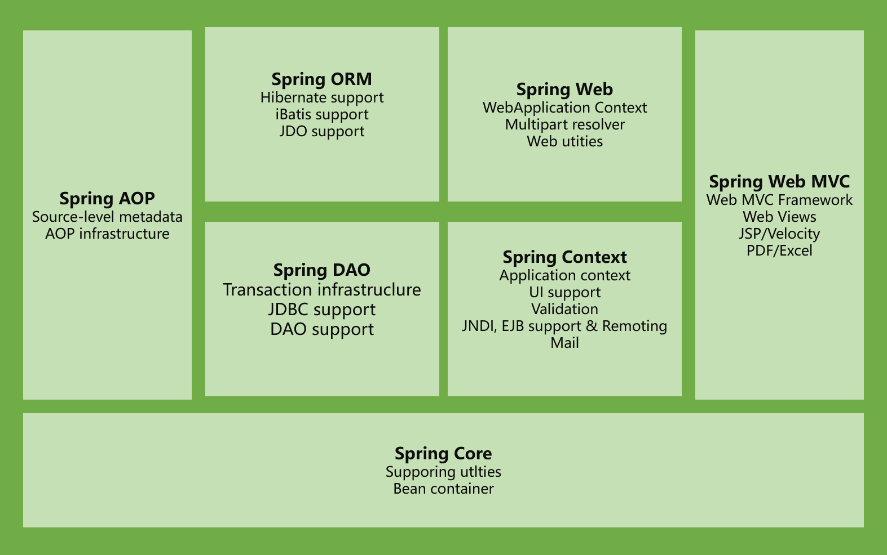

# Spring架构

## Spring MVC

### 1 SpringMVC概述

Spring为展现层提供的基于MVC设计理念的优秀的Web框架,是目前最主流的MVC框架之一
Spring3.0后全面超越Struts2 ,成为最优秀的MVC框架
Spring MVC通过一套MVC注解,让POJO成为处理请求的控制器,而无须实现任何接口。
支持REST风格的URL请求
采用了松散耦合可插拔组件结构,比其他MVC框架更具扩展性和灵活性

### 2 Spring Web MVC是什么

Spring Web MVC是一一个MVC的开源框架, SpringMVC是spring的一一个后续产品,是spring在原有基础上,又提供了web应用的MVC模块,可以简单的把springMVC理解为是spring的一一个模块(类似AOP , I0C这样的模块)，springMVC和spring无缝集成, (其实SspringMVC就是spring的一一个 子模块,所以根本不需要同spring进行整合)。Spring Web MVC是一种基于Java的实现了Web MVC设计模式的请求驱动类型的轻量级Web框架,即使用了MVC架构模式的思想,将web层进行职责解耦,基于请求驱动指的就是使用请求响应模型,框架的目的就是帮助我们简化开发, Spring Web MVC也是要简化我们日常Web开发的。

### 3 Spring Web MVC能做什么

让我们能非常简单的设计出干净的Web层和薄薄的Web层;

* 进行更简洁的Web层的开发;
* 天生与Spring框架集成(如IOC容器、AOP等) ;
* 提供强大的约定大于配置的契约式编程支持;
* 能简单的进行Web层的单元测试;
* 支持灵活的URL到页面控制器的映射;
* 非常容易与其他视图技术集成,如Velocity、FreeMarker等等 ,因为模型数据不放在特定的API里,而是放在一个Model里( Map数据结构实现,因此很容易被其他框架使用) ;
* 非常灵活的数据验证、格式化和数据绑定机制,能使用任何对象进行数据绑定,不必实现特定框架的API ;
* 提供一套强大的JSP标签库 ,简化SP开发;
* 支持灵活的本地化、主题等解析;
* 更加简单的异常处理;
* 对静态资源的支持;
* 支持Restful风格。

### 4 措建的第一-个SpringMVC框架

#### 4.1加入jar包

`commons-logging-x.x.x.jar`
`spring-aop-x.x.x.RELEASE.jar`
`spring-beans-x.x.x.RELEASE.jar`
`spring-context-x.x.x.RELEASE.jar`
`spring-core-x.x.x.RELEASE.jar`
`spring-expression-x.x.x.RELEASE.jar`
`spring-web-x.x.x.RELEASE.jar`
`spring-webmvc-x.x.x.RELEASE.jar`

#### 4.2 Web.xml配置

配置DispatcherServlet : DispatcherServlet默认加载/WEB- INF/<servletName -servlet> .xml的Spring配置文件，启动WEB层的Spring容器。
可以通过contextConfigLocation初始化参数自定义配置文件的位置和名称

#### DispatcherServlet

#### 4.3加入Spring MVC的配置文件

#### 4.4编写处理请求的处理器,并标识为处理器

### 5 @RequestMapping映射请求

**@RequestMapping可用于修饰在:**

* 类定义处：提供初步的请求映射信息。相对于WEB应用的根目录
* 方法处：提供进一步的细分映射信息。 相对于类定义处的URL。若类定义处未标注@RequestMapping ,则方法处标记的URL相对于WEB应用的根目录

在处理方法入参处使用@RequestMapping注解为控制器指定处理URL请求

* **value** :指定请求的实际地址(请求URL)

* **method** :指定请求的method类型，GET、POST、PUT、DELETE等(请求方法)
* **params**: 与method相类似,作用为了细化映射。只有当URL中包含与params值相匹配的参数的请求,处理方法才会被调用例: params={"uname", "age!=50"}

* **headers** :用于细化映射。只有当请求的Request Headers中包含与heanders值相匹配的参数,处理方法才会被调用(请求头)

**@RequestMapping(method)** ：指定页面请求方式(method的值一旦指定,那么,处理方法就只对指定的http

method类型的请求进行处理)

* produces = "application/json; charset=utf-8"

在spring mvc中, @ResponseBody返回的默认编码为ISO-8859-1 , 但是实际需要的是UTF-8 ,所以需要转换

**使用`@RequestMapping`**映射请求`@RequestMapping`支持Ant风格的URL :
Ant风格资源地址支持3种匹配符:

* `?` ：匹配文件名中的一一个字符

* `*`：匹配文件名中的任意字符
* `**` :匹配多层路径

```url
/user/*/createUser:匹配-
/user/aaa/createUser,  /user /bbb/createUser等URL
/user /**/createUser:匹配-
/user/createUser,   /user /aaa/bbb/createUser等URL
/user/createUser??:匹配-
/user/createUseraa, /user /createUserbb等URL
```

**JSP标签路径统- -设计**

```jsp
<%
	String path = request.getContextPath();
    String basePath =request.getScheme()+"://"+request .getServerName()
            +":"+request.getServerPort()+path+"/";
%>
```

```html
<base href="<%=basePath %>"/> 
```

### 6 请求处理方法签名

Spring MVC通过分析处理方法的签名,将HTTP请求信息绑定到处理方法的相应参数中。

Spring MVC对控制器处理方法签名的限制是很宽松的，几乎可以按喜欢的任何方式对方法进行签名。必要时可以对方法及方法入参标注相应的注解( `@RequestParam`.` @PathVariable`等 )

Spring MVC框架会将HTTP请求的信息绑定到相应的方法入参中,并根据方法的返回值类型做出相应的后续处理。

#### @RequestParam

使用`@RequestParam`绑定请求参数值

在处理方法入参处使用@RequestParam可以把请求参数传递给请求方法
- **value或name** ：请求参数的参数名
- **required** ：是否必须。默认为true,表示请求参数中必须包含对应的参数,若不存在,将抛出异常
- **defaultValue** ：请求参数的默认值

```java
@RequestMapping(name = "index")     //  user/index
public String index(@RequestParam(name = "age",required = false,
                                  defaultValue = "20")int age){
	System.out.println(age);
    return "index";
}
```

#### @PathVariable

注解：映射URL绑定的占位符

带占位符的URL是Spring3.0新增的功能,该功能在SpringMVC向REST目标挺进发展过程中具有里程碑的意义通过`@PathVariable`可以将URL中占位符参数绑定到控制器处理方法的入参中: URL中的{xx}占位符可以通过`@PathVariable("xxx")`绑定到操作方法的入参中。

```java
@ResponseBody
@RequestMapping(value = "index1/{id}")
public String index1(@PathVariable("id")int id){
	System.out.println("id的值是："+id);
    return "ID = "+id;
}
```

#### POJO

使用POJO对象绑定请求参数值

Spring MVC会按请求参数名和POjO属性名进行自动匹配,自动为该对象填充属性值。支持级联属性(对象属性)。

如: uname/ grade.gname等

```java
@RequestMapping(value = "add")
public String add(User user, HttpServletRequest request, HttpServletResponse response, @RequestParam(value = "age")int age) throws UnsupportedEncodingException {
	request.setCharacterEncoding("UTF-8");
    response.setCharacterEncoding("UTF-8");
    System.out.println(user);
    int num = userService.insert(user);
    System.out.println("添加 "+num+" 个用户，年龄 age = "+age);
    request.setAttribute("user",user);
    return "/user/user-view.jsp";
}
```

如果是User类有一个`Grade grade`属性，则需将html/jsp的属性名设置为`grade.name`,`grade.number`,springMVC会自动匹配。

#### Servlet API

Spring MVC中,控制器类可以不依赖于ServletAPI对象,但是SpringMVC并不阻止用户使用。ServletAPI可以同时
和其它入参同时使用。且位置顺序没有要求。( 如果处理方法自行使用response返回响应,则处理方法返回值设
为void即可)

**HttpServletRequest**

**HttpServletResponse**

**HttpSession**

java.securty.Principal

Locale

InputStream

OutputStream

Reader

Writer

#### 关于重定向

一般情况下 ,控制器方法返回字符串类型的值会被当成逻辑视图名处理如果返回的字符串中带**forward:**或**redirect:**前缀时, SpringMVC会对他们进行特殊处理:将**forward:**和**redirect:**当成指示符,其后的字符串作为URL来处理

​	`redirect:successjsp` :会完成-一个到success.jsp的重定向的操作

​	`forward:success.jsp` :会完成一个到success.jsp的转发操作

```java
/**
 *  转发
 * @return
 */
@RequestMapping(value = "t1")
public String t1(){
	return "forward:/index.jsp";
}

/**
 *  重定向
 * @return
 */
@RequestMapping(value = "t2")
public String t2(){
    return "redirect:/index.jsp";
}
```

#### 处理模型数据

Spring MVC提供了以下几种途径输出模型数据:

**Map及Model**：入参为org.springframework.ui.Model. org.springframework.ul. ModelMap或java.uti.Map时,处理方法返回时, Map中的数据会自动添加到模型中

**ModelAndView**：处理方法返回值类型为ModelAndView时，方法体即可通过该对象添加模型数据

**Map及Model**

Spring MVC在调用方法前会创建一一个隐含的模型对象作为模型数据的存储容器。

如果方法的入参为Map或Mode1类型，Spring MVC会将隐含模型的引用传递给这些入参。

在方法体内，开发者可以通过这个入参对象访问到模型中的所有数据，也可以向模型中添加新的属性数据

```java
/***
 * Map
 * @return
 */
@RequestMapping(value = "map/{id}")
public String selectById(@PathVariable("id")int id, HttpServletRequest request, Map map){
	User user = userService.selectById(id);
	map.put("id",id);
    map.put("user",user);
    return "/user/user-view.jsp";
}
/***
 * Model
 * @return
 */
@RequestMapping(value = "model/{id}")
public String selectById1(@PathVariable("id")int id, HttpServletRequest request,
                          Model model){
	User user = userService.selectById(id);
    model.addAttribute("id",id);
    model.addAttribute("user",user);
    return "/user/user-view.jsp";
}
```

**ModelAndView**

控制器处理方法的返回值如果为ModelAndview, 则其既包含视图信息，也包含模型数据信息。

* 添加模型数据:

  ```java
  ModelAndview addobject (String attributeName, object attributevalue)
  ModelAndView addAllobject (Map<String,?> modelMap)
  ```

* 设置视图:

  ```
  void setView(View view)
  void setViewName(String viewName)
  ```

```java
@RequestMapping(value = "modelAndView/{id}")
public ModelAndView selectById3(@PathVariable("id")int id){
	ModelAndView modelAndView = new ModelAndView();
    User user = userService.selectById(id);
    modelAndView.setViewName("/user/user-view.jsp");
    modelAndView.addObject("user",user);
    return modelAndView;
}
```

### 7 SpringMVC编码格式

```xml
<!-- SpringMVC编码格式处理UTF-8 -->
<filter>
	<filter-name>characterEncodingFilter</filter-name>
    <filter-class>org.springframework.web.filter.CharacterEncodingFilter</filter-class>
    <init-param>
    	<param-name>encoding</param-name>
        <param-value>UTF-8</param-value>
	</init-param>
    <init-param>
    	<param-name>forceEncoding</param-name>
        <param-value>true</param-value>
	</init-param>
</filter>
<filter-mapping>
    <filter-name>characterEncodingFilter</filter-name>
	<url-pattern>/*</url-pattern>
</filter-mapping>
```

### 8 SpringMVC执行流程


### 回顾


