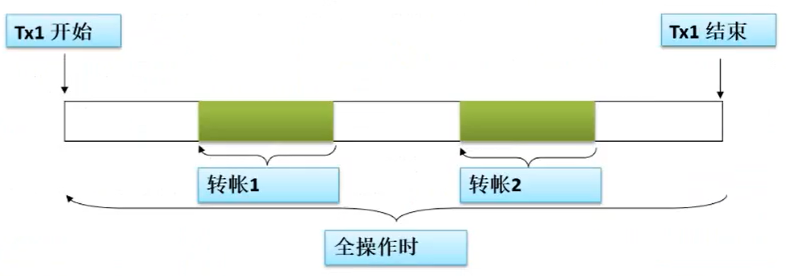
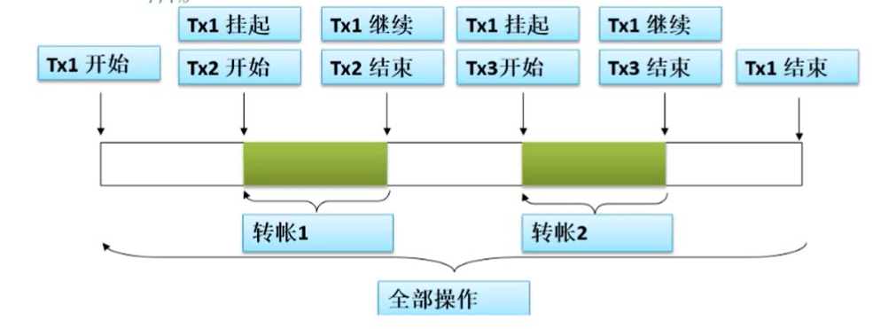

# Spring事务管理

## 1. 事务简介

事务管理是企业级应用程序开发中必不可少的技术，主要用来确保数据的完整性和一致性。

事务就是一系列的动作,它们被当做一个单独的工作单元.这些动作要么全部完成,要么全部不起作用

### 事务的四个关键属性(ACID)

**原子性(atomicity)**:事务是-一个原子操作, 由一系列动作组成. 事务的原子性确保动作要么全部完成要么完全不起作用。

**一致性(consistency)**: - -旦所有事务动作完成,事务就被提交.数据和资源就处于-种满足业务规则的一 致性状态中。

**隔离性(isolation)**:可能有许多事务会同时处理相同的数据,因此每个事物都应该与其他事务隔离开来,防止数据损坏。

**持久性(durability)**: -旦事务完成，无论发生什么系统错误,它的结果都不应该受到影响.通常情况下，事务的结果被写到持久化存储器中。

## 2. Spring中的事务管理

作为企业级应用程序框架，Spring在不同的事务管理API之上定义了一个抽象 层.而应用程序开发人员不必了解底层的事务管理API,就可以使用Spring的事务管理机制.
**Spring既支持编程式事务管理,也支持声明式的事务管理.**

### 编程式事务管理:

将事务管理代码嵌入到业务方法中来控制事务的提交和回滚.在编程式管理事务时,必须在每个事务操作中包含额外的事务管理代码.

### 声明式事务管理:

大多数情况下比编程式事务管理更好用.它将事务管理代码从业务方法中分离出来,以声明的方式来实现事务管理.事务管理作为-种横切关注点可以通过AOP方法模块化. Spring通过Spring AOP框架支持声明式事务管理.

## 3. Spring中的事务管理器

Spring从不同的事务管理API中抽象了-整套的事务机制.开发人员不必了解底层的事务API,就可以利用这些事务机制.有了这些事务机制，事务管理代码就能独立于特定的事务技术了.

### JDBC操作

在应用程序中只需要处理一一个数据源而且通过JDBC存取

DataSourceTransactionManager

### JTA操作

在JavaEE应用服务器上用JTA(Java Transaction API)进行事务管理

JtaTransactionManager

### Hibernate操作

框架存取数据库

TransactionManager

## 4. 案例开发

### 1. 转账功能

账户表：account

| 字段名  | 类型 | 说明 | 描述   |
| ------- | ---- | ---- | ------ |
| id      |      |      | 主键ID |
| name    |      |      | 姓名   |
| balance |      |      | 余额   |
| cardid  |      |      | 卡号   |

## 2. 商品下单功能

商品表：product

| 字段名 | 类型 | 说明 | 描述     |
| ------ | ---- | ---- | -------- |
| id     |      |      | 主键ID   |
| name   |      |      | 商品名称 |
| count  |      |      | 数量     |
| price  |      |      | 价格     |

## 5. Spring声明式注解事务

### @Transaction注解声明式的管理事务

`@Transactional`可以作用于接口、接口方法、类以及类方法上。当作用于类上时,该舞的所有public方法将都具有该类型的事务属性,同时,我们也可以在方法级别使用该标注来覆盖类级别的定义。

**建议**：虽然`@Transactional`注解可以作用于接口、接口方法、类以及类方法上,但是Spring建议不要在接口或者接口方法上使用该注解，`@Transactional`注解应该只被应用到public 方法上,这是由Spring AOP的本质决定的。如果你在protected、private或者默认可见性的方法.上使用`@Transactional`注解,这将被忽略,也不会抛出任何异常。


## 6. Spring 事务回滚机制

@Transactional可以作用于接口、接口方法、类以及类方法上。当作用于类上时,该舞的所有public方法将都具
有该类型的事务属性,同时,我们也可以在方法级别使用该标注来覆盖类级别的定义。
建议:虽然@Transactional注解可以作用于接口、接口方法、类以及类方法上,但是Spring建议不要在接口或
者接口方法上使用该注解，
@Transactional注解应该只被应用到public 方法上,这是由Spring AOP的本质决定的。如果你在protected、
private或者默认可见性的方法.上使用@Transactional注解,这将被忽略,也不会抛出任何异常。

## 7. @Transaction注解详解

| 属性                 | 类型                               | 描述                                   |
| -------------------- | ---------------------------------- | -------------------------------------- |
| value                | String                             | 可选的限定描述符，指定使用的事务管理器 |
| propagation          | enum：propagation                  | 可选的事务传播行为设置                 |
| isolation            | enum：isolation                    | 可选的事务隔离级别设置                 |
| readOnly             | boolean                            | 读写和只读事务，默认只读               |
| timeout              | int(in seconds granularity)        | 事务超时实践设置                       |
| rollBackFor          | Class对象数组，必须继承自Throwable | 导致事务回滚的异常类数组               |
| rollBackForClassName | 类命数组，必须继承自Throwable      | 导致事务回滚的异常类名字数组           |
| noRollBackFor        | Class对象数组，必须继承自Throwable | 不会导致事务回滚的异常类数组           |
| rollBackForClassName | 类命数组，必须继承自Throwable      | 不会导致事务回滚的异常类名字数组       |

### 事务的传播属性

当事务方法被另一个事务方法调用时，必须指定事务应该如何传播。例如：方法可能在继续在现有事务中运行，也可能开启一个新事物，并在自己的事务中运行。

事务的传播行为可以由出阿伯属性指定，Spring定义了7种传播行为。

| 传播属性      | 描述                                                         |
| ------------- | ------------------------------------------------------------ |
| REQUIRED      | 如果有事务在运行，当前的方法就在这个事务内运行，否则，就启动一个新的事务，并在自己的事务内运行 |
| REQUIRED_NEW  | 当前的方法必须启动新的事务，并在它自己的事务内运行，如果有事务在运行，就将他挂起 |
| SUPPORTS      | 如果有事务在运行，当前的方法就在这个事务内运行，否则他可以不运行在事务内 |
| NOT_SIPPORTED | 当前的方法不应该运行在该事务中，如果有运行的事务，将他挂起   |
| MANDATORY     | 当前的方法必须运行在事务的内部，如果没有正在运行的事务，就抛出异常 |
| NEVER         | 当前方法不应该运行在事务中，如果有运行的事务，就抛出异常     |
| NESTED        | 如果有事务在运行，当前的方法就应该在这个事务的嵌套事务内运行，否则，就启动一个新的事务，并在它自己的事务内运行 |

事务的传播属性可以在@Transactional注解的propagation属性中定义。

#### REQUIRED传播行为

当前方法被另一个事务调用时，将会合并成一个事务

当前转账（1对1）方法被另一个事务方法调用时，它默认会在现有的事务内运行。这个默认的传播行为就是REQUIRED。因此在全操作方法的开始和终止边界内只有一个事务。这个事务只在全操作方法结束的时候被提交,事务传播属性可以在`@Transactional`注解的propagation属性中定义。



```java
@Transactional(propagation = Propagation.REQUIRES_NEW)
@Override
public int transfer(int cardId, int targetCardId, double balance) {
	Account account1 = accountDao.selectByCardId(cardId);
    if(account1==null){
    	throw new AccountException(cardId+" : 账号不存在");
	}else if (account1.getBalance()<balance){
    	throw new AccountException(cardId+": 账户余额不足");
	}
    Account account2 = accountDao.selectByCardId(targetCardId);
    if(account2==null){
    	throw new AccountException(targetCardId+" : 账号不存在");
	}
    int num1 = accountDao.updateSubByCardId(cardId, balance);
    if(num1<1){
    	throw new AccountException(cardId+" : 转账失败");
	}
    int num2 = accountDao.updateAddByCardId(targetCardId, balance);
    if (num2<1){
    	throw new AccountException(targetCardId+" : 转账失败");
	}
    System.out.println(cardId+" ======》 "+targetCardId+"：转账成功");
    return 1;
}

@Transactional(propagation= Propagation.REQUIRED)
@Override
public int transferA11(int cardId, int[] targetCardIds, double balance) {
	for (int i=0;i <targetCardIds.length;i++){
    	this.transfer (cardId,targetCardIds[i],balance) ;
	}
    return 1;
}
```

#### REQUIRED_NEW传播行为

该方法必须启动一个新的事务，并且在自己的事务内运行。如果有事务在运行就先将他挂起。



##### 注意:

REQUIRES_NEW嵌套的事务里的方法都在一个类里的话，里面的即使是新建的事务，执行完方法也不会提交。原因是A方法(有事务)调用B方法(要独立新事务) , 如果两个方法写在同一个类里, spring的事务会只处理同一个事务。

1. 需要将两个方法分别写在不同的类里。
2. 调用B方法的时候，将service自己注入自己，用这个注入对象来调用B方法。

```java
package com.mzw.service.impl;
import com.fasterxml.jackson.databind.deser.std.ThrowableDeserializer;
import com.mzw.bean.Account;
import com.mzw.dao.AccountDao;
import com.mzw.exception.AccountException;
import com.mzw.service.AccountService;
import org.springframework.beans.factory.annotation.Autowired;
import org.springframework.stereotype.Service;
import org.springframework.transaction.annotation.Propagation;
import org.springframework.transaction.annotation.Transactional;

@Service
public class AccountServiceImpl implements AccountService {

    @Autowired
    private AccountDao accountDao;
    /**
     *1、查询转出方帐户是否存在cardId
     * 2、查看转出方的余额是否满足转帐要求
     * 3、查询转入方帐户是否存在
     * 4、转出方卡号减去相应金额
     * 5、转入方卡号增加相应金额
     *
     * @param cardId
     * @param targetCardId
     * @param balance
     * @return
     */
    @Transactional(propagation = Propagation.REQUIRES_NEW)
    @Override
    public int transfer(int cardId, int targetCardId, double balance) {
        Account account1 = accountDao.selectByCardId(cardId);
        if(account1==null){
            throw new AccountException(cardId+" : 账号不存在");
        }else if (account1.getBalance()<balance){
            throw new AccountException(cardId+": 账户余额不足");
        }
        Account account2 = accountDao.selectByCardId(targetCardId);
        if(account2==null){
            throw new AccountException(targetCardId+" : 账号不存在");
        }
        int num1 = accountDao.updateSubByCardId(cardId, balance);
        if(num1<1){
            throw new AccountException(cardId+" : 转账失败");
        }
        int num2 = accountDao.updateAddByCardId(targetCardId, balance);
        if (num2<1){
            throw new AccountException(targetCardId+" : 转账失败");
        }
        System.out.println(cardId+" ======》 "+targetCardId+"：转账成功");
        return 1;
    }

    /***
     * 给全体员工转账
     * @param cardId
     * @param targetCardIds
     * @param balance
     * @param accountService
     * @return
     * @throws AccountException
     */
    @Transactional(propagation = Propagation.REQUIRES_NEW)
    @Override
    public int transferA11(int cardId, int[] targetCardIds, double balance,AccountService accountService) throws AccountException {
        for (int i=0;i <targetCardIds.length;i++){
            accountService.transfer (cardId,targetCardIds[i],balance) ;
        }
        return 1;
    }
}
```

